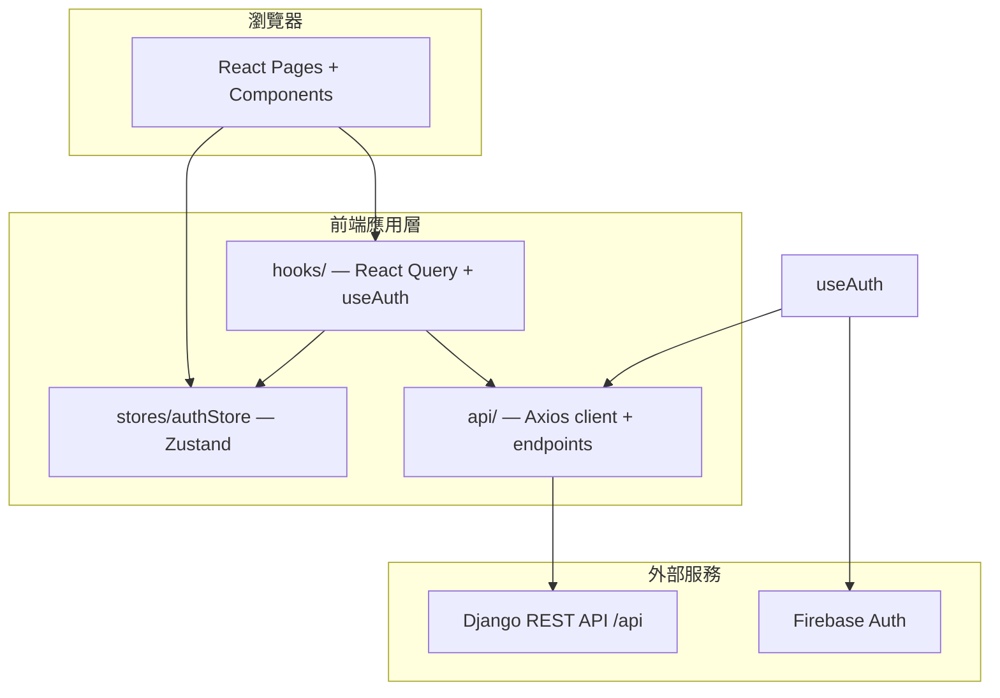
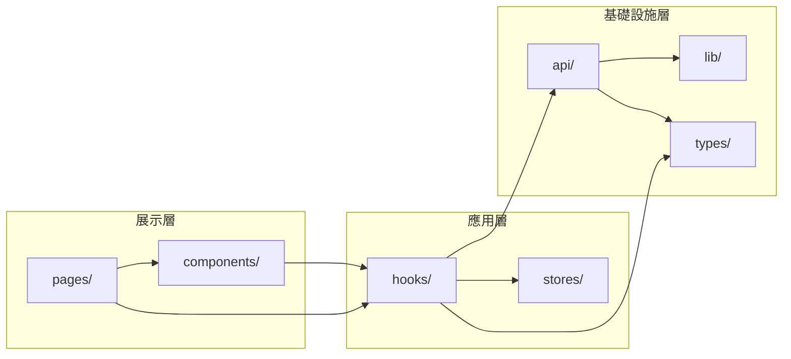
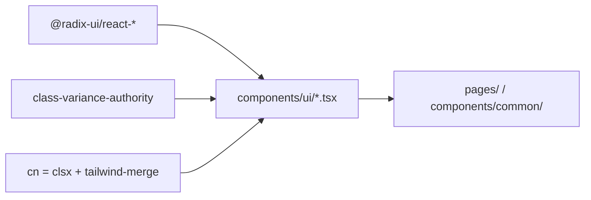
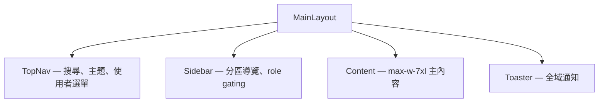
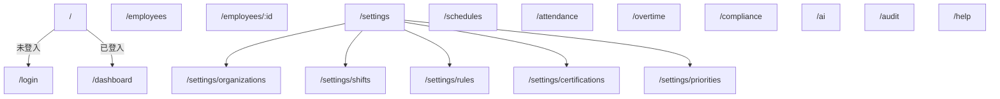
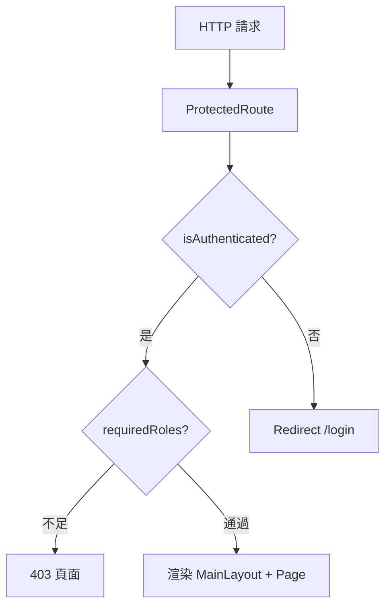
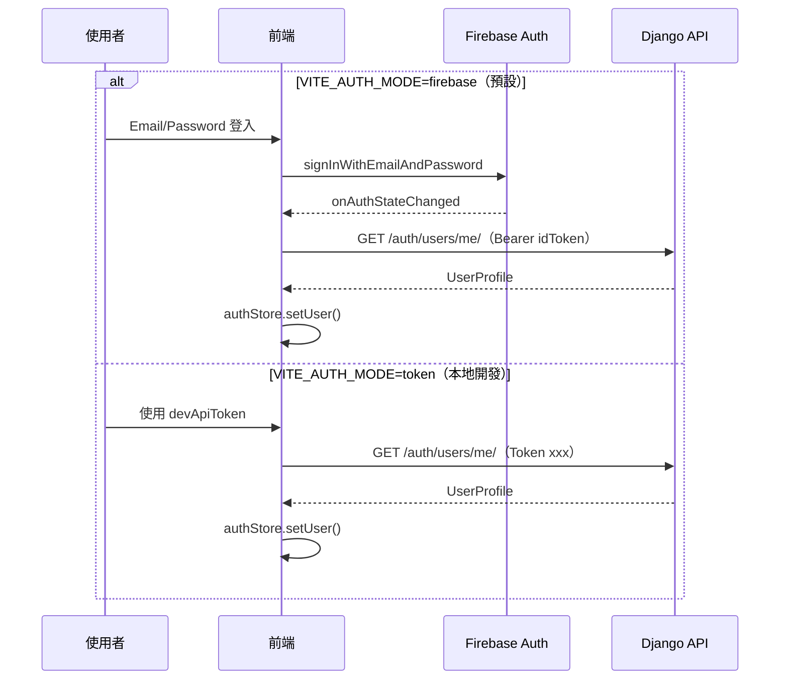
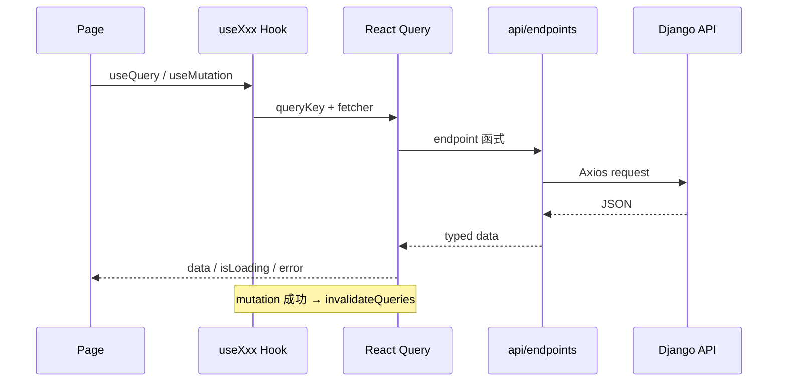
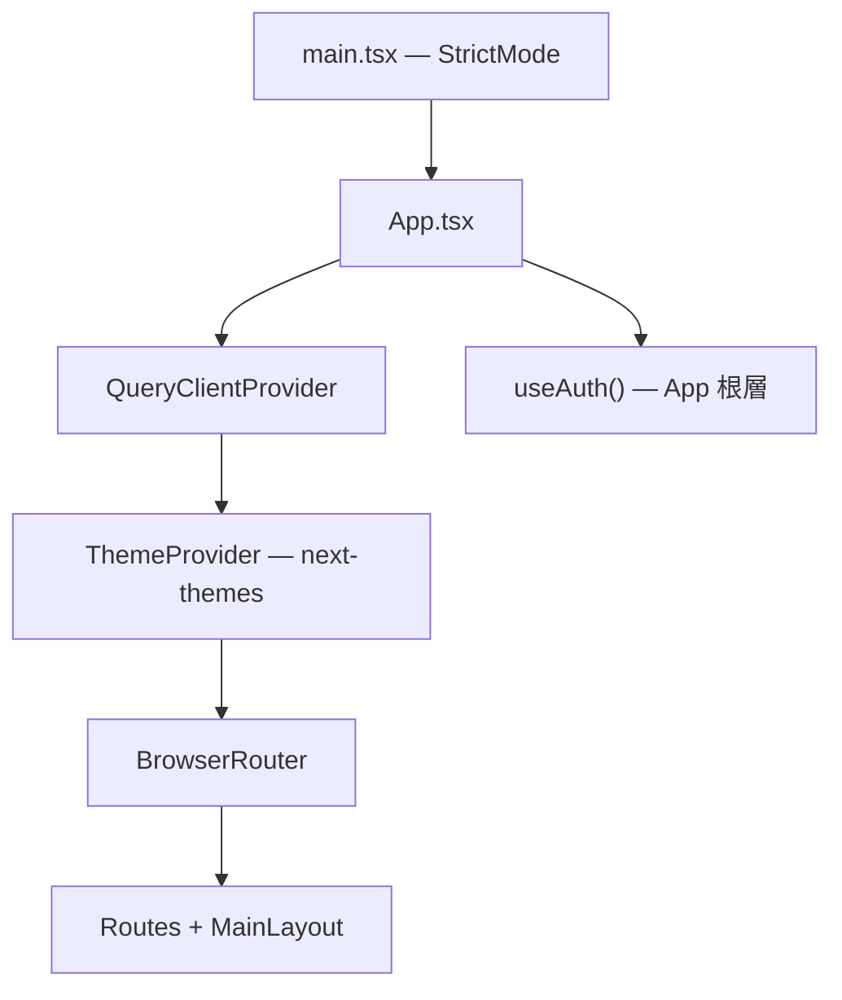

# 前端架構說明

AI 智慧排班系統前端（`scheduling-frontend`）的設計架構、目錄職責、資料流與依賴套件說明。  
後端 API 契約請參考 `scheduling-api-main/FRONTEND_MIGRATION_GUIDE.md`；測試流程請參考 `FRONTEND_ARCH_AND_TEST.md`。

---

## 1. 技術棧

| 類別 | 技術 | 版本（package.json） | 用途 |
|------|------|----------------------|------|
| 框架 | React + TypeScript | React ^19.2.4 / TS ~5.9.3 | UI 與型別安全 |
| 建置 | Vite | ^8.0.1 | 開發伺服器、打包 |
| 樣式 | Tailwind CSS | ^4.2.2（`@tailwindcss/vite`） | Utility-first CSS |
| 元件基礎 | Radix UI | 見 devDependencies | 無障礙原語（Dialog、Select 等） |
| 元件模式 | shadcn/ui 風格 | — | `cva` + `cn()` 的 variant 模式 |
| 路由 | React Router | ^7.13.1 | SPA 路由、巢狀 Outlet |
| 伺服器狀態 | TanStack React Query | ^5.94.5 | 快取、mutation、invalidate |
| 客戶端狀態 | Zustand | ^5.0.12 | 登入 profile、角色（persist） |
| HTTP | Axios | ^1.13.6 | API client + 攔截器 |
| 認證 | Firebase Auth | ^12.11.0 | Email/Password 登入 |
| 主題 | next-themes | ^0.4.6 | 亮/暗模式（`.dark` class） |
| 圖示 | lucide-react | ^0.577.0 | 側欄與頁面 icon |

**路徑別名：** `@/` → `src/`（`vite.config.ts` + `tsconfig.json`）

**TypeScript 設定：** `strict: true`，`noUnusedLocals` / `noUnusedParameters` 開啟。

---

## 2. 系統總覽



---

## 3. 分層架構



### 3.1 目錄結構

```
src/
├── api/
│   ├── client.ts                 # Axios instance、Token 攔截器、401 重試
│   └── endpoints/                # 各 domain API 封裝
│       ├── auth.ts
│       ├── organizations.ts
│       ├── employees.ts
│       ├── shifts.ts
│       ├── schedules.ts
│       ├── attendance.ts
│       ├── compliance.ts
│       ├── billing.ts
│       └── ai.ts
├── components/
│   ├── common/                     # 可複用業務元件（DataTable 等）
│   ├── layout/                     # MainLayout、Sidebar、TopNav
│   ├── providers/                  # ThemeProvider
│   ├── ui/                         # shadcn/ui 風格基礎元件
│   └── ProtectedRoute.tsx          # 登入守衛 + 403
├── hooks/
│   ├── useAuth.ts
│   ├── useEmployees.ts
│   ├── useOrganizations.ts
│   ├── useShifts.ts
│   ├── useSchedules.ts
│   ├── useAttendance.ts
│   ├── useBilling.ts
│   └── use-toast.ts
├── lib/
│   ├── firebase.ts                 # Firebase 初始化
│   └── utils.ts                    # cn()
├── pages/                          # 功能頁面（見 §5）
├── stores/
│   └── authStore.ts
├── types/                          # API 回應與 domain 型別
├── App.tsx                         # 路由、Provider 組裝
├── main.tsx                        # React 入口
└── index.css                       # Design tokens + 全域樣式
```

### 3.2 各層職責

| 層級 | 目錄 | 職責 |
|------|------|------|
| 展示層 | `pages/` | 頁面組裝、表單、使用者互動 |
| 展示層 | `components/` | 可複用 UI、版面、路由守衛 |
| 應用層 | `hooks/` | React Query 查詢/mutation、認證副作用 |
| 應用層 | `stores/` | 跨頁面客戶端狀態（使用者、角色） |
| 基礎設施 | `api/` | HTTP 通訊、endpoint 封裝 |
| 基礎設施 | `types/` | 與後端契約對齊的 TypeScript 型別 |
| 基礎設施 | `lib/` | 第三方 SDK 初始化、工具函式 |

**約定：**

- Page 不直接呼叫 Axios，透過 `hooks/` 或 `api/endpoints/` 存取後端。
- Mutation 成功後以 `queryClient.invalidateQueries()` 刷新列表。
- 金額/工時等數值型別在 `types/` 與 UI 層保持與後端一致（避免不必要的 float 轉換）。

---

## 4. 設計系統

### 4.1 Design Tokens

`index.css` 採 **HSL CSS Variables**（shadcn/ui 慣例），並以 Tailwind v4 `@theme` 映射為語意 class：

| Token 類別 | 代表變數 | Tailwind 用法範例 |
|------------|----------|-------------------|
| 表面 | `--background`, `--foreground` | `bg-background`, `text-foreground` |
| 元件 | `--card`, `--popover`, `--muted` | `bg-card`, `text-muted-foreground` |
| 互動 | `--primary`, `--secondary`, `--accent` | `bg-primary`, `hover:bg-accent` |
| 狀態 | `--destructive`, `--ring` | `text-destructive`, `ring-ring` |
| 圖表 | `--chart-1` ~ `--chart-5` | `text-chart-1` |
| 圓角 | `--radius` | `rounded-lg`（經 `@theme` 映射） |

暗色模式：`<html class="dark">`（由 `next-themes` + `ThemeProvider` 控制）。

### 4.2 UI 元件模式



目前已實作的 `components/ui/` 元件：

`avatar` · `badge` · `button` · `card` · `dialog` · `dropdown-menu` · `input` · `label` · `select` · `tabs` · `toast` · `toaster`

### 4.3 版面配置



- 桌面：固定左側 Sidebar（`w-64`），主內容 `md:ml-64`。
- 行動：Sidebar 以 overlay 方式顯示（`#mobile-sidebar`）。

### 4.4 自訂樣式 utility

`index.css` 另定義專案級 class，供 Dashboard、AI 等頁面使用：

| Class | 用途 |
|-------|------|
| `glass-card` | 毛玻璃卡片 |
| `card-hover` / `card-float` | 卡片 hover 動效 |
| `btn-glow` | 按鈕光澤動畫 |
| `fade-in` | 頁面進場 |
| `pulse-ring` | 通知 badge 脈動 |
| `type-cursor` / `blink` | AI 打字/思考指示 |

---

## 5. 路由與資訊架構

### 5.1 路由樹



| 路由 | 頁面 | 說明 |
|------|------|------|
| `/login` | `LoginPage` | 公開；Email/Password（Firebase） |
| `/dashboard` | `DashboardPage` | 營運總覽（部分統計串 API，部分 mock 展示） |
| `/employees` | `EmployeesPage` | 員工列表、搜尋、新增 |
| `/employees/:id` | `EmployeeDetailPage` | 契約、證照、在職狀態 |
| `/settings/*` | `SettingsPage` + Outlet | Tabs 巢狀路由（見下表） |
| `/schedules` | `SchedulesPage` | 排班版本、週視圖、合規檢查 |
| `/attendance` | `AttendancePage` | 出勤紀錄 |
| `/overtime` | `OvertimePage` | 加班管理 |
| `/compliance` | `CompliancePage` | 合規驗證 |
| `/ai` | `AIAssistantPage` | AI 法規助手 |
| `/audit` | `AuditPage` | 操作日誌 |
| `/help` | `PlaceholderPage` | 占位 |

**設定子路由（`/settings`）：**

| Tab 路徑 | 頁面 | SettingsPage Tab 是否顯示 |
|----------|------|---------------------------|
| `/settings/shifts` | `ShiftTemplatesPage` | 是 |
| `/settings/priorities` | `EmployeePrioritiesPage` | 是（路由見 §6.2 備註） |
| `/settings/rules` | `ShiftRulesPage` | 是 |
| `/settings/organizations` | `OrganizationsPage` | 是 |
| `/settings/certifications` | `CertificationsPage` | 否（路由存在，Tab 未列入） |

### 5.2 權限控制



| 機制 | 位置 | 行為 |
|------|------|------|
| 路由守衛 | `ProtectedRoute` | 未登入 → `/login`；`requiredRoles` 不符 → 403 |
| 導覽 gating | `Sidebar` | 「系統設定」僅 `admin` / `manager` |
| 角色判斷 | `authStore.hasRole()` | `role_name` 為空視為 superuser（全權） |

---

## 6. 認證與 API 資料流

### 6.1 認證流程

支援兩種模式（`VITE_AUTH_MODE`）：



**401 處理（`api/client.ts`）：**

- Firebase 模式：`getIdToken(true)` 刷新後自動重送原請求。
- Token 模式：僅在請求確實帶 `Token` header 時才清除 `devApiToken`，避免初始化死循環。

### 6.2 特殊模式：BYPASS_AUTH

`VITE_BYPASS_AUTH=true` 時：

- 略過 `useAuth()` 與 `ProtectedRoute`。
- `/login` 自動導向 `/dashboard`。
- 設定預設 tab 為 `/settings/shifts`（一般模式預設為 `/settings/organizations`）。
- `BYPASS_AUTH` 路由包含 `/settings/priorities`；一般 `ProtectedRoute` 路由尚未註冊此 path。

> 用途：Firebase Hosting demo 或無後端 auth 的靜態部署驗收。

### 6.3 CRUD 資料流



**React Query 預設（`App.tsx`）：**

- `staleTime`: 5 分鐘
- `retry`: 1 次

### 6.4 API 模組對照

| Endpoint | Hook | Types | Domain |
|----------|------|-------|--------|
| `auth.ts` | `useAuth` | `auth.ts` | 登入、profile |
| `organizations.ts` | `useOrganizations` | `organization.ts` | 機構、分店 |
| `employees.ts` | `useEmployees` | `employee.ts` | 員工、契約、證照 |
| `shifts.ts` | `useShifts` | `shift.ts` | 班別模板、排班規則 |
| `schedules.ts` | `useSchedules` | `schedule.ts` | 排班版本、排班、合規 |
| `attendance.ts` | `useAttendance` | `attendance.ts` | 出勤 |
| `compliance.ts` | — | `compliance.ts` | 合規（頁面直接呼叫或待補 hook） |
| `billing.ts` | `useBilling` | `billing.ts` | 計費、加班試算 |
| `ai.ts` | — | `ai.ts` | AI 助手 |

---

## 7. Provider 與應用啟動



`useAuth()` 必須在 `App` 根層呼叫，確保 `ProtectedRoute` 的 `isLoading` 能正確結束，避免 loading 死鎖。

---

## 8. 依賴套件

### 8.1 dependencies（執行期）

| 套件 | 用途 | 備註 |
|------|------|------|
| `react` / `react-dom` | UI 框架 | v19 |
| `react-router-dom` | 路由 | v7 |
| `@tanstack/react-query` | 伺服器狀態 | — |
| `zustand` | 客戶端狀態 | 含 `persist` middleware |
| `axios` | HTTP | — |
| `firebase` | 認證 | — |
| `class-variance-authority` | 元件 variant | 搭配 shadcn 模式 |
| `clsx` + `tailwind-merge` | `cn()` | — |
| `next-themes` | 主題 | class strategy |
| `lucide-react` | Icon | — |
| `i18next` + `react-i18next` | 國際化 | **已安裝，src 尚未引用** |
| `recharts` | 圖表 | **已安裝，src 尚未引用** |
| `@vitejs/plugin-react` | Vite React 插件 | 列於 dependencies |

### 8.2 devDependencies（開發期）

| 套件 | 用途 |
|------|------|
| `vite` | 建置與 dev server |
| `typescript` | 型別檢查 |
| `tailwindcss` + `@tailwindcss/vite` | CSS 框架 |
| `@types/react` / `@types/react-dom` | React 型別 |
| `@radix-ui/react-*` | avatar, checkbox, dialog, dropdown-menu, label, select, separator, slot, switch, tabs, toast, tooltip |

---

## 9. 環境變數

複製 `.env.example` 為 `.env` 或 `.env.local`：

| 變數 | 預設 | 說明 |
|------|------|------|
| `VITE_API_BASE_URL` | `/api` | API base；dev 時由 Vite proxy 轉發 |
| `VITE_AUTH_MODE` | `firebase` | `firebase` 或 `token` |
| `VITE_FIREBASE_*` | — | Firebase 專案設定（6 個欄位） |
| `VITE_BYPASS_AUTH` | — | 設為 `true` 跳過登入（demo 用） |

**Vite dev server：**

- 前端：`http://localhost:3000`
- Proxy：`/api` → `http://localhost:8000`

**建置指令：**

```bash
npm install
npm run dev      # 開發
npm run build    # tsc + vite build
npm run preview  # 預覽 production build
```

---

## 10. 功能成熟度（概覽）

| 模組 | 路由 | API Hook | 成熟度 |
|------|------|----------|--------|
| 登入 / 認證 | `/login` | `useAuth` | 完整 |
| 儀表板 | `/dashboard` | `useEmployees` 等 | 部分 mock UI |
| 員工管理 | `/employees` | `useEmployees` | 完整 CRUD |
| 系統設定 | `/settings/*` | `useOrganizations`, `useShifts` | 完整 CRUD |
| 排班管理 | `/schedules` | `useSchedules` | 完整（版本、合規、週視圖） |
| 出勤 | `/attendance` | `useAttendance` | 已有頁面與 hook |
| 加班 | `/overtime` | `useBilling` | 已有頁面與 hook |
| 合規 | `/compliance` | endpoint 已有 | 頁面已建 |
| AI 助手 | `/ai` | endpoint 已有 | 頁面已建 |
| 稽核 | `/audit` | — | 頁面已建 |
| 幫助 | `/help` | — | 占位 |

---

## 11. 延伸閱讀

| 文件 | 內容 |
|------|------|
| `FRONTEND_ARCH_AND_TEST.md` | 測試流程、常見問題排查 |
| `scheduling-api-main/FRONTEND_MIGRATION_GUIDE.md` | API 契約與 migration 說明 |
| 根目錄 `CLAUDE.md` | Monorepo 總覽與後端架構 |

---

*最後更新：依 `scheduling-frontend/src` 現況整理。*
